# Naman Mudgal

### AI/ML Engineer | Generative AI | RAG | Backend Development

AI/ML Engineer building with Generative AI, RAG, AI Agents, and backend systems. I enjoy turning ideas and research into practical, reliable software.

Currently focused on building AI applications, intelligent workflows, and production-oriented backend systems, while continuing to explore the intersection of machine learning, software engineering, and research.

## About Me

I am a Computer Science student specializing in Artificial Intelligence and Machine Learning. My work has taken me across machine learning, deep learning, Generative AI, RAG, AI agents, backend engineering, and applied research.

I enjoy working on problems where there is room to experiment, build, and improve. From developing document intelligence systems to designing backend services and exploring ML applications in cryptography, I like understanding how things work beneath the surface rather than just using them.

- B.Tech in Computer Science and Engineering, specializing in Artificial Intelligence and Machine Learning
- Focused on Generative AI, RAG, AI Agents, Machine Learning and Backend Engineering
- Research experience in Machine Learning and Cryptography
- Published research in Quantum Computing
- 300+ LeetCode problems solved

## Tech Stack

### Languages

  

Python • C++ • JavaScript • TypeScript • SQL

### AI / Machine Learning

  

PyTorch • TensorFlow • Keras • Scikit-learn • NumPy • Pandas • Matplotlib

Machine Learning • Deep Learning • NLP • Transformers • Computer Vision • Model Evaluation

### Generative AI

  

LangChain • LangGraph • Hugging Face • Gemini • Groq

LLMs • RAG • Prompt Engineering • AI Agents • Agentic Workflows • Embeddings • Vector Search • LLM Evaluation

### RAG & Vector Databases

Qdrant • ChromaDB • FAISS

Semantic Search • Document Chunking • Embeddings • Retrieval Pipelines • Citation-based RAG • Multi-document RAG

### Backend & Web Development

  

FastAPI • Next.js • React • Node.js • Streamlit

REST APIs • Authentication • Async APIs • Microservices • Backend Architecture

### Databases, Infrastructure & Cloud

  

PostgreSQL • Redis • Docker • Git • GitHub • Google Cloud • Vertex AI • Vercel • Cloudflare • Cloudinary • Postman

## What I've Been Building

### 3GPP RAG Chatbot

A Retrieval-Augmented Generation system designed to answer questions from 3GPP technical specifications while keeping hallucinations as low as possible.

The system works with TR 21.905, TS 23.501, TS 23.502 and TS 38.300, using document processing, BGE embeddings, Qdrant and an LLM-based retrieval pipeline.

The project was built with a strong focus on reliable retrieval and source-aware responses rather than simply generating answers from an LLM.

**Technologies:** Python • FastAPI • Qdrant • RAG • BGE Embeddings • LLMs • Groq • Vercel • Render

[View Repository](https://github.com/nmnmdgl/3gpp-rag)

### AutoStream

An AI-powered sales automation application built around agentic workflows.

AutoStream uses LangGraph to orchestrate AI workflows and combines retrieval, lead management and content-related automation into a single application.

**Technologies:** Python • LangGraph • LangChain • Gemini • ChromaDB • Streamlit

[View Repository](https://github.com/nmnmdgl/AutoStream)

### DocQuery

A multi-document RAG application for interacting with PDF documents through natural language.

It supports multiple document uploads, semantic retrieval, conversational memory and source-level citations, making it possible to trace responses back to the underlying documents.

**Technologies:** Python • RAG • LLMs • Vector Databases • Streamlit

[View Repository](https://github.com/nmnmdgl/DocQuery)

### PathGenie

An AI-powered career guidance application that generates personalized career paths and learning roadmaps based on a user's education, interests and skills.

The idea was to make career exploration more structured by combining user information with Generative AI to produce actionable paths rather than generic career suggestions.

**Technologies:** Python • Streamlit • LangChain • Gemini • Vertex AI • FAISS

[Live Application](https://pathgenieai.streamlit.app/)  
[View Repository](https://github.com/nmnmdgl/PathGenie)

### AI Portfolio & NIFTY50 Allocator

An AI-assisted portfolio optimization and backtesting application focused on Indian equities.

The project combines traditional portfolio optimization methods such as Modern Portfolio Theory and Risk Parity with LSTM forecasting and SHAP-based explainability.

**Technologies:** Python • Streamlit • yFinance • PyPortfolioOpt • LSTM • SHAP • Pandas • NumPy • Gemini

## Research

My research work has mainly explored the intersection of machine learning, deep learning and cryptography.

During my internship at DRDO SAG, I worked on Machine Learning in Cryptography, including neural cryptography based on the Alice, Bob and Eve framework and experiments involving adversarial training and cryptographic loss functions.

I have also explored deep-learning approaches involving AES, image classification and autoencoder architectures.

My broader research interests include AI for cybersecurity, neural cryptography, emerging computing technologies and practical applications of machine learning.

### Publication

Published research related to Quantum Computing.

**DOI:** 10.33889/PMSL.2025.4.2.020

## Experience

### Associate Consultant Intern — SMARRTIF AI

Working on AI and software engineering problems involving modern AI technologies and application development.

### AI/ML Research Intern — DRDO SAG

Worked on Machine Learning in Cryptography and explored neural-network-based approaches to cryptographic systems.

## Problem Solving

I regularly practice Data Structures and Algorithms and have solved 300+ problems on LeetCode.

My problem-solving practice covers arrays, strings, hashing, linked lists, trees, graphs, dynamic programming, searching, sorting, greedy algorithms, recursion and backtracking.

## GitHub Statistics

  
  

  

## Contribution Activity

  

## Contribution Graph

  <picture>
    <source
      media="(prefers-color-scheme: dark)"
      srcset="https://raw.githubusercontent.com/nmnmdgl/nmnmdgl/output/github-snake-dark.svg"
    />
    <source
      media="(prefers-color-scheme: light)"
      srcset="https://raw.githubusercontent.com/nmnmdgl/nmnmdgl/output/github-snake.svg"
    />
    
  </picture>

## Connect

  
  
  

  <i>Building practical AI systems and exploring the intersection of AI, software engineering and research.</i>

